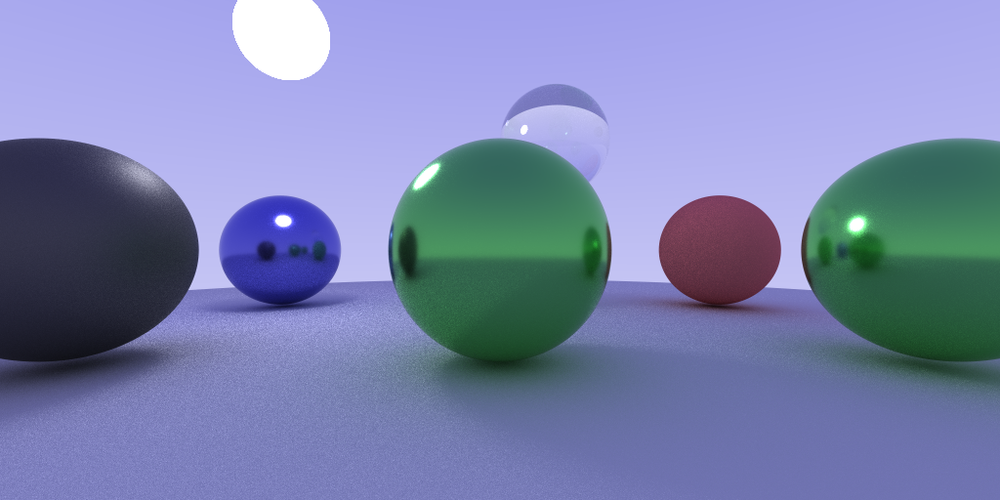
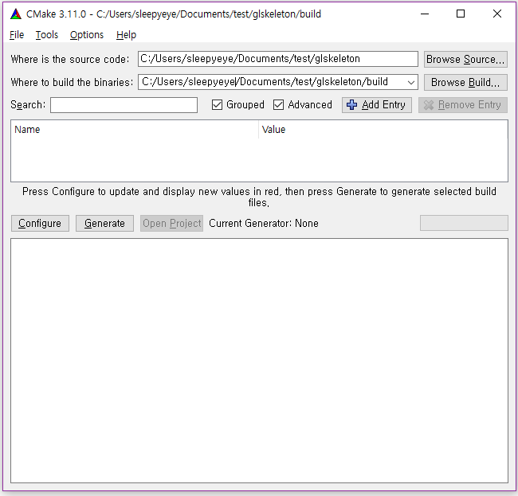
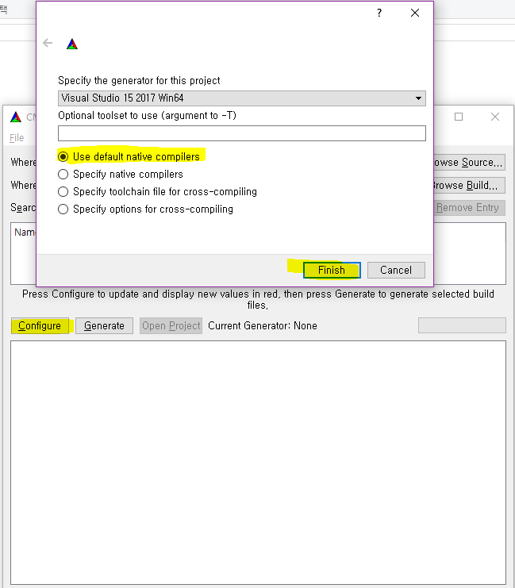

# Neon

Neon is a minimal ray tracer written in C++. Originally, It was wrrtien for my own learning
purpose. This is part of the ray tracer which can be used as base code for assignment in 
the Computer Graphics course at GIST.
 



# Installation 

```sh
git clone https://github.com/junho1218/physically-based-ray-tracer.git
```


# Build

## For *windows* user

1. Create build folder in project root

2. Run cmake gui(Configure and Generate)

You need to re-run cmake whenever you add more source files (\*.h, \*.cpp)

3. Set path for build and source folder



Set source code directory to *project-root*.

Set build directory to *project-root/build*.

4. Configure



5. Generate


6. Build the project

- Go to build folder
- Open *neon.sln* file
- Make *neon-sandbox* as startup project and build it

## For *linux* user

1. Run cmake

You need to re-run cmake command whenever you add more source files (\*.h, \*.cpp)
```sh
cd <PROJECT_ROOT>
mkdir build
cd build
cmake ..
```

2. Build and compile

```sh
make -j4
```


# Dependancies

- [lodepng](https://github.com/lvandeve/lodepng), Very simple png read/write library
- [glm](https://github.com/g-truc/glm.git), Math library for OpenGL and GLSL shader
- [taskflow-cpp](https://github.com/cpp-taskflow/cpp-taskflow), Task-based
  parallelism library


# System Requirements 

To use Neon, you need a C++ compiler which supports C++17 and cmake.

- C++ Compiler
  - GCC  >= 7.3 
  - Clang >= 6.0
  - Visual Studio Version >= 15.7 
- Cmake > 3.13


# License 

Neon is licensed under the [MIT License](https://github.com/CGLAB-Classes/neon-edu/blob/master/LICENSE)


